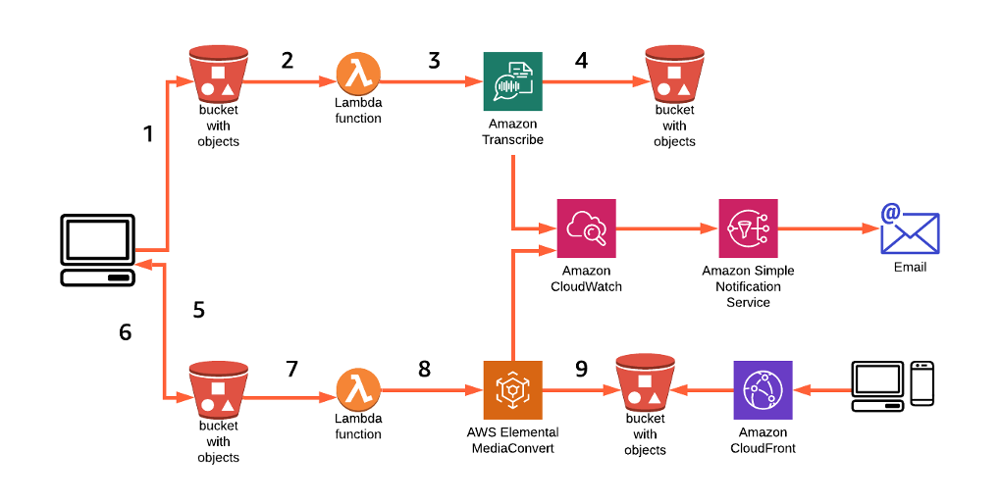
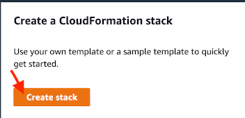
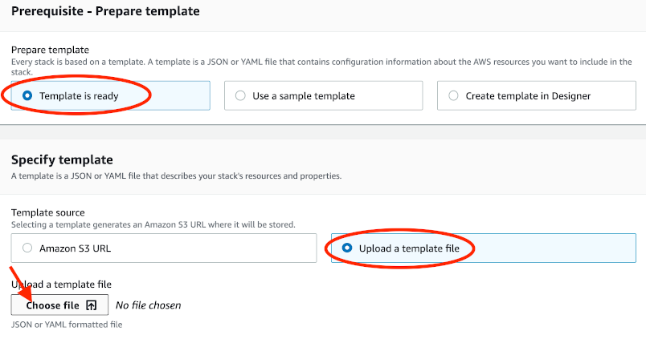
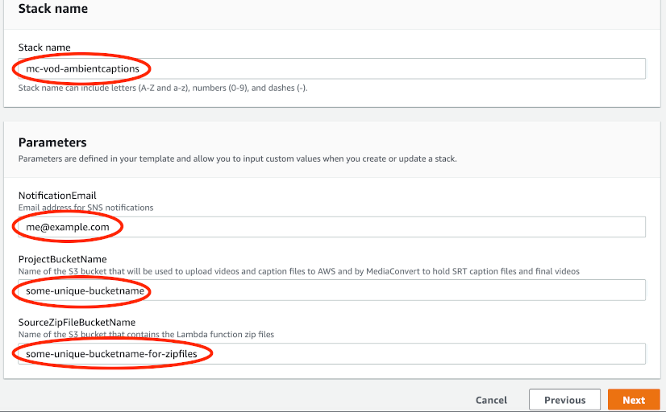
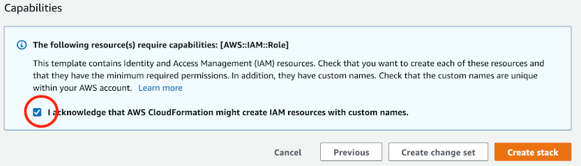
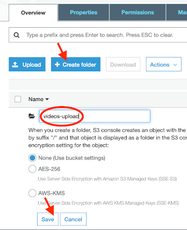
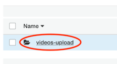
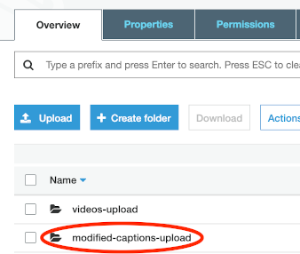
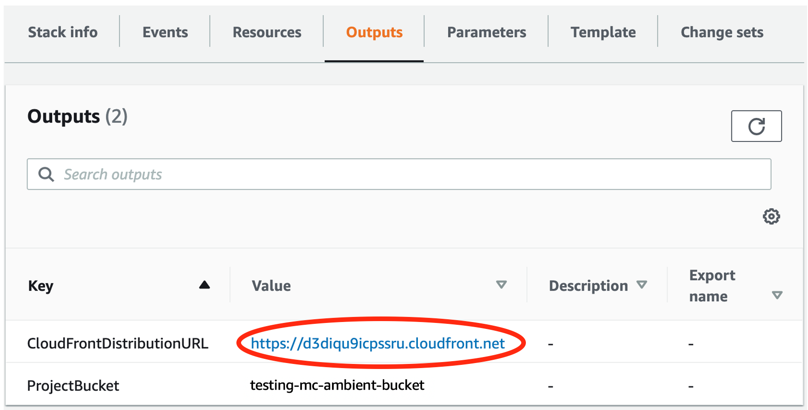
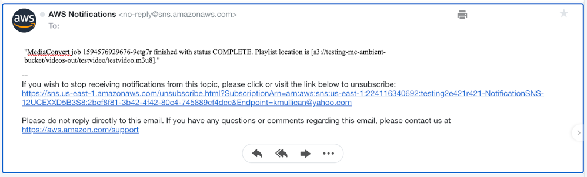

# Use AWS MediaConvert and Amazon Transcribe to Create Ambient Captions for Video on Demand

This sample project provides the ability to create ambient captions for video on demand (VOD) using AWS MediaConvert and Amazon Transcribe. An out-of-the-box industry solution to automatically transcribe contextual sounds for closed captions does not currently exist. This sample project workflow incorporates as much automation as possible but does include a step requiring manual modification of a transcript file.  This sample code is functional for us-east-1 region only.

AWS resources and automation workflow are created by running the provided CloudFormation template.

Below is a diagram showing the workflow for this sample project.
	

# Requirements

### AWS Account

You'll need an AWS Account with access to create AWS MediaConvert, Transcribe, IAM, SNS, S3, CloudWatch, and Lambda resources. 

### Billing

MediaConvert jobs will incur charges. See: https://aws.amazon.com/mediaconvert/pricing.

### Source video (mp4 format)

You will need to have an .mp4 video, without captions, to upload to AWS.  The video must be in .mp4 format.

**MediaConvert job produces HLS M3U8 playlist output with the following characteristics:**
* Captions: WebVTT in English language
* Outputs: 1920x1080, 1080x720, 640x360
* Video Codec: H_264
* Audio Codec: AAC

**Other AWS resources**

S3, CloudFront, Transcribe, and other resources you will launch as part of this workshop are eligible for the AWS free tier if your account is less than 12 months old. See the [AWS Free Tier page](https://aws.amazon.com/free/) for more details.

### Video player

Video can be played directly in the browser if the browser supports .m3u8 (Safari browser can play .m3u8 files directly), or in the video player of your choice.  You may want to also check out https://hls-js.netlify.app/demo/.

# Let's get started!

## Download this project and prepare the CloudFormation template
A CloudFormation [template](cloudformation/cloudformation.yaml) is provided in this repo but requires some preparation -- prior to running CloudFormation, Lambda function zip files provided in this repo must be uploaded to an S3 bucket in your AWS account. CloudFormation will read the zip files from the S3 bucket during stack creation.

Follow these [CloudFormation template preparation steps](source/README.md)

## Run the CloudFormation template
**1.** Log into your AWS account and access CloudFormation in the AWS Console.  Click `Create Stack`

 

**2.** Choose `Template is Ready`, `Upload a template file`, and click `Choose File`.  Browse to the `cloudformation.yaml` file from this project and upload it.  Click `Next`.

 
	
**3.** Fill in values for the `Stack name`, `NotificationEmail`, `ProjectBucketName`, and `SourceZipFileBucketName`,  and click `Next`.

 
	
**4.** On the "Configure stack Options" / "Advanvced options" page, take all defaults and click `Next`.

**5.** On the "Review" page, take all defaults and check the box to acknowledge that AWS CloudFormation might create IAM resources with custom names.  Click `Create stack` to launch the stack.

 
	
Resources will be ready to use in approx. 5-10 minutes.

## Confirm your email subscription
During CloudFormation stack creation, you will receive an SNS topic subscription confirmation email at the email address that you specified.  Before proceeding, you must click the link in that email to confirm your SNS topic subscription.  If you skip this step, the automated email messages in the workflow will not function.

## Steps to create ambient captions for your source .mp4 video

**1.** Navigate to the S3 bucket and create a videos-upload folder (note: the automation workflow expects the name of this folder to be videos-upload). 

 
	
Click into the folder and upload your source .mp4 video.

 

**2. (automatic)** After your upload completes, Lambda Python function will automatically execute.   

**3. (automatic)** The Lambda function creates an AWS Transcribe job which will create a .JSON output file from the source video.

**4. (automatic)** The Lambda function saves the .JSON transcription output file to the S3 bucket.  CloudWatch events monitors the Transcribe job and sends an email via SNS to the address that you specified when job is complete (note: in order to receive this email, you must have already clicked the link in the subscription confirmation email).

**5.** Download the .JSON file from the S3 bucket to your computer.  Modify the .json file and add the appropriate ambient captions.  You can use software of your choice here, or even a text editor such as vim.

**6.** You will notice that a new folder "modified-video-uploads" has been automatically created for you in the S3 bucket.  Upload the modified .json file to this new folder.

 

**7. (automatic)** After your upload completes, Lambda Python function will automatically execute.

**8. (automatic)** The Lambda function converts .JSON to .SRT format and then initiates a MediaConvert job that uses parameters in the provided MediaConvert template to embeds WebVTT captions in your source .mp4 video and create HLS output.  CloudWatch events sends an email notification when the MediaConvert job is in progress.

**9. (automatic)** An output folder is created in the S3 bucket and the MediaConvert .m3u8 playlist is saved to the folder.  CloudWatch events sends an email notification when the MediaConvert job is complete.

## Access the CloudFront URL and play the final video
The CloudFront Distribution for your S3 output folder has been automatically created and the CloudFront URL can be found in the CloudFormation output.  
 

When you receive the email that the MediaConvert job has completed, you are ready to play the final video.  
 

Simply paste the CloudFront URL into a Safari web browser (or the player of your choice) and add the video name (without the .mp4 suffix) to the end of the URL as shown here:
`<cloudfront URL>/<name of video>/<name of video>.m3u8`

Example: original source video was `mytest123.mp4`.  The CloudFront playback URL will be `<cloudfront URL>/mytest123/mytest123.m3u8`

You should see an option to enable captions in the video.  Choose English language to view the captions.

# Limitations and Assumptions

- Uploaded video must be in .mp4 format for compatibility with the Amazon Transcribe service. Transcribe accuracy depends on the audio quality.

- This solution only works with English audio input.

- This sample workflow assumes that .mp4 video filenames are unique.

- This sample code is functional for us-east-1 region only.

- Lambda functions created for this workload are for reference only.

- This solution will send the notifications by email (this option could be modify by the user).

- When this CloudFormation stack is deleted, the S3 buckets used in this workflow will be preserved.  If you no longer want the S3 buckets, you must delete them manually.

# Credits

Jillian Forde, AWS Solutions Architect and host of AWS "How to Build This", was the inspiration for this project which benefits diversity and inclusion initiatives

John Councilman, AWS Elemental Solutions Architect, provided expertise with MediaConvert and industry captioning practices

Arturo Velasco, AWS Solutions Architect, code review and repo recommendations

Rob Dachowski, AWS SA Manager, original author of Python script to convert Amazon Transcribe JSON output to SRT format

# Contributors

Katreena Mullican
